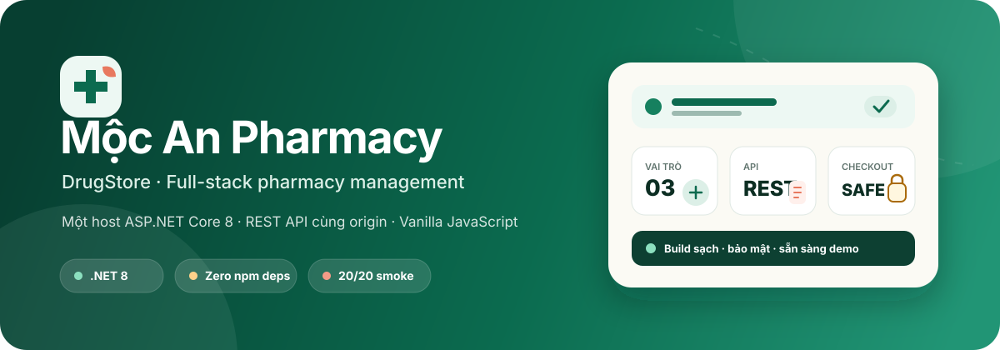
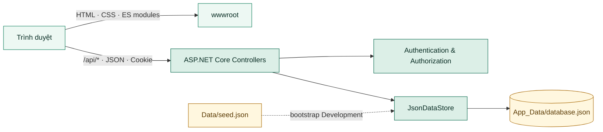

<p align="center">
  
</p>

<h1 align="center">DrugStore · Mộc An Pharmacy</h1>

<p align="center">
  Một ứng dụng quản lý nhà thuốc full-stack gọn nhẹ, an toàn và dễ chạy:<br />
  <strong>ASP.NET Core 8 + REST API + Vanilla JavaScript trên cùng một host.</strong>
</p>

<p align="center">
  <a href="./BackendApp/BackendApp.csproj"></a>
  <a href="./BackendApp/Program.cs"></a>
  <a href="./BackendApp/wwwroot/assets/js"></a>
  <a href="https://github.com/alexmerex/DrugStore/actions/workflows/ci.yml"></a>
</p>

<p align="center">
  <a href="#-điểm-nổi-bật">Điểm nổi bật</a> ·
  <a href="#-chạy-thử-trong-2-phút">Chạy thử</a> ·
  <a href="#-kiến-trúc">Kiến trúc</a> ·
  <a href="#-api-chính">API</a> ·
  <a href="#-kiểm-thử">Kiểm thử</a> ·
  <a href="#-triển-khai">Triển khai</a>
</p>

> [!IMPORTANT]
> Đây là dự án minh họa kỹ thuật và quản lý nghiệp vụ cơ bản. Nội dung sản phẩm không phải tư vấn y khoa; JSON store hiện tại không thay thế cơ sở dữ liệu production.

## 🌿 Dự án giải quyết điều gì?

DrugStore mô phỏng trọn vẹn một cửa hàng dược phẩm trực tuyến quy mô nhỏ: khách hàng khám phá sản phẩm và đặt hàng, nhân viên vận hành catalog/đơn hàng, còn quản trị viên quản lý tài khoản và phân quyền.

Điểm nhấn của dự án không chỉ nằm ở CRUD. Luồng checkout được thiết kế để chống tạo đơn trùng khi mất mạng hoặc hai tab cùng thao tác, phát hiện giá đã thay đổi và bảo toàn chính xác giỏ hàng trong các tình huống cạnh tranh.

## ✨ Điểm nổi bật

| | Khả năng |
| --- | --- |
| 🛍️ **Storefront hoàn chỉnh** | Tìm kiếm, lọc danh mục, chi tiết sản phẩm, giỏ hàng, đăng ký/đăng nhập và lịch sử đơn hàng. |
| 👥 **Ba vai trò rõ ràng** | `buyer`, `staff`, `admin` với policy được kiểm tra tại server, không dựa vào việc ẩn nút ở frontend. |
| 🔁 **Checkout đáng tin cậy** | Idempotency key, price check nguyên tử, pending retry và khóa nhiều tab bằng Web Locks hoặc bakery lock trên `localStorage`. |
| 🔐 **Bảo mật có chủ đích** | PBKDF2-HMAC-SHA256, cookie `HttpOnly`, `SameSite=Strict`, rate limit, CSP, HSTS và Problem Details. |
| 🧾 **Lịch sử không bị biến dạng** | Đơn lưu snapshot tên, giá, đơn vị, hình ảnh và số đăng ký ngay tại thời điểm mua. |
| 📦 **Không cần frontend toolchain** | HTML/CSS/ES modules thuần; không `npm install`, không bundler, không CDN runtime. |
| 💾 **Dữ liệu demo dễ quan sát** | JSON store ghi nguyên tử, tự chuẩn hóa dữ liệu cũ và tách seed bất biến khỏi dữ liệu runtime. |
| ✅ **Bộ kiểm thử tự chứa** | Static verification và smoke/integration test không phụ thuộc package bên thứ ba. |

## 🧭 Trải nghiệm theo vai trò

| Vai trò | Màn hình | Khả năng chính |
| --- | --- | --- |
| Khách | Cửa hàng, chi tiết sản phẩm, giỏ hàng cục bộ | Xem/tìm/lọc sản phẩm, quản lý giỏ localStorage, tạo tài khoản và đăng nhập |
| `buyer` | Cửa hàng, giỏ hàng, đơn của tôi | Mọi quyền khách; đặt hàng, retry an toàn, xem lịch sử và hủy đơn `new` |
| `staff` | Khu vực nhân viên | CRUD sản phẩm/danh mục, xem và xử lý vòng đời đơn |
| `admin` | Khu vực quản trị | Toàn bộ quyền staff, CRUD tài khoản và thay đổi vai trò |

Trạng thái đơn đi theo luồng `new` → `processing` → `completed`; đơn `new` hoặc `processing` có thể chuyển sang `cancelled`. Trạng thái cuối không thể thay đổi tiếp.

## 🚀 Chạy thử trong 2 phút

### Yêu cầu

- [.NET 8 SDK](https://dotnet.microsoft.com/download/dotnet/8.0)
- Trình duyệt hiện đại
- Node.js 18+ chỉ khi chạy test

### Khởi động

```powershell
git clone https://github.com/alexmerex/DrugStore.git
Set-Location DrugStore
dotnet restore BackendApp/BackendApp.csproj
dotnet run --project BackendApp/BackendApp.csproj --launch-profile BackendApp
```

Mở <http://localhost:5222> và chọn luồng muốn trải nghiệm:

| Trang | Đường dẫn |
| --- | --- |
| Cửa hàng | <http://localhost:5222/> |
| Chi tiết sản phẩm mẫu | <http://localhost:5222/product.html?id=1> |
| Nhân viên | <http://localhost:5222/seller.html> |
| Quản trị | <http://localhost:5222/admin.html> |
| Health check | <http://localhost:5222/health> |

### Tài khoản demo

| Vai trò | Tên đăng nhập | Mật khẩu |
| --- | --- | --- |
| Người mua | `buyer1` | `buyer123` |
| Nhân viên | `staff1` | `staff123` |
| Quản trị viên | `admin1` | `admin123` |

> [!WARNING]
> Các tài khoản trên là credential công khai dành riêng cho `Development`. Không tái sử dụng chúng khi triển khai thật.

## 🏗️ Kiến trúc



Ứng dụng dùng **một host duy nhất**: ASP.NET Core vừa phục vụ frontend trong `BackendApp/wwwroot`, vừa cung cấp API cùng origin. Cách tổ chức này loại bỏ CORS/config frontend riêng và giúp cookie phiên hoạt động tự nhiên.

### Luồng checkout an toàn

```mermaid
sequenceDiagram
    actor Buyer as Buyer / Tab
    participant Cart as Cart state
    participant API as Orders API
    participant Store as JSON store

    Buyer->>Cart: Chụp nguyên tử items + token; khóa mọi mutation
    Cart-->>Buyer: Pending attempt bền vững
    Buyer->>API: POST /api/orders + idempotencyKey
    API->>Store: Khóa ghi, kiểm tra key và giá
    alt Cùng key, cùng payload
        Store-->>API: Trả lại đơn đã tạo
    else Giá vừa thay đổi
        Store-->>API: 409 price-changed, không ghi đơn
    else Request mới hợp lệ
        Store-->>API: Ghi bill + snapshot sản phẩm
    end
    API-->>Buyer: 200 / 201 / 409
    Buyer->>Cart: Cleanup đúng line identity, không xóa món vừa thêm lại
```

### Thành phần chính

| Thành phần | Trách nhiệm |
| --- | --- |
| `Program.cs` | Composition root, middleware, cookie auth, rate limit, forwarded headers, static files và health check |
| `Controllers/` | REST endpoints, validation, authentication và role policies |
| `JsonDataStore` | Tuần tự hóa đọc/ghi, normalize/validate, migration và atomic replace |
| `PasswordService` | Hash/verify PBKDF2 và nâng cấp credential cũ |
| `wwwroot/assets/js` | API client, shell, cart nhiều tab và logic từng trang |

## 🗃️ Dữ liệu

- `BackendApp/Data/seed.json` là dữ liệu mẫu bất biến được version control.
- `Development` tạo `BackendApp/App_Data/database.json` ở lần chạy đầu; thư mục này được Git ignore.
- Mật khẩu seed đã hash PBKDF2; plaintext từ phiên bản cũ được nâng cấp khi khởi động.
- Có thể đổi file runtime bằng `DrugStore:DataFilePath` hoặc `DrugStore__DataFilePath`.
- Ứng dụng từ chối data path nằm trong `wwwroot` hoặc trỏ thẳng vào seed.
- JSON store phù hợp demo/một tiến trình; production nhiều instance nên chuyển sang database giao dịch.

Muốn reset dữ liệu Development, dừng ứng dụng rồi xóa riêng `BackendApp/App_Data/database.json`. Hãy sao lưu trước nếu cần giữ thay đổi cục bộ.

## 🔌 API chính

API dùng JSON camelCase và [Problem Details](https://www.rfc-editor.org/rfc/rfc9457) cho lỗi. Endpoint cần đăng nhập trả `401`; thiếu quyền trả `403`.

<details>
<summary><strong>Mở bảng endpoint</strong></summary>

| Method | Endpoint | Quyền | Mô tả |
| --- | --- | --- | --- |
| `GET` | `/health` | Public | Health check |
| `GET` | `/api/auth/session` | Public | Đọc phiên hiện tại |
| `POST` | `/api/auth/login` | Public | Đăng nhập, tạo cookie phiên |
| `POST` | `/api/auth/register` | Public | Tạo buyer và đăng nhập |
| `POST` | `/api/auth/logout` | Authenticated | Kết thúc phiên |
| `GET` | `/api/products` | Public | Tìm/lọc sản phẩm, tối đa 200 kết quả |
| `GET` | `/api/products/{id}` | Public | Chi tiết sản phẩm |
| `POST` | `/api/products` | Staff/Admin | Tạo sản phẩm |
| `PUT`, `DELETE` | `/api/products/{id}` | Staff/Admin | Sửa/xóa sản phẩm |
| `GET` | `/api/categories[/{id}]` | Public | Danh sách hoặc chi tiết danh mục |
| `POST`, `PUT`, `DELETE` | `/api/categories[/{id}]` | Staff/Admin | Quản lý danh mục |
| `POST` | `/api/orders` | Buyer | Tạo đơn với price check và idempotency |
| `GET` | `/api/orders/mine` | Buyer | Đơn của người mua hiện tại |
| `GET` | `/api/orders` | Staff/Admin | Toàn bộ đơn |
| `GET` | `/api/orders/{id}` | Authenticated | Đọc đơn theo quyền sở hữu/vai trò |
| `PATCH` | `/api/orders/{id}/status` | Authenticated | Xử lý đơn hoặc buyer hủy đơn `new` |
| `GET`, `POST` | `/api/users` | Admin | Liệt kê/tạo tài khoản |
| `GET`, `PUT`, `DELETE` | `/api/users/{id}` | Admin | Quản lý một tài khoản |

</details>

Các request mẫu có sẵn trong [`BackendApp/BackendApp.http`](./BackendApp/BackendApp.http).

### Hợp đồng idempotency

Frontend gửi `idempotencyKey` gắn với đúng payload đã chuẩn hóa của giỏ. Key là duy nhất trong phạm vi từng buyer. Gửi lại cùng key và cùng `productID`/tổng `quantity`/`expectedUnitPrice` sẽ nhận lại đơn cũ; fingerprint phân biệt cả trường hợp `expectedUnitPrice` có mặt và bị bỏ. Dùng key đó cho payload khác trả `409 /problems/idempotency-conflict`. Giá đã cũ trả `409 /problems/price-changed` mà không tạo đơn.

Key dài 16–100 ký tự, bắt đầu bằng chữ ASCII hoặc số; phần còn lại chỉ gồm chữ ASCII, số, `.`, `_`, `:`, `-`.

## 🛡️ Bảo mật

- PBKDF2-HMAC-SHA256, salt ngẫu nhiên, 120.000 vòng lặp; API không trả password.
- Mật khẩu mới dài 8–128 ký tự; bootstrap admin production yêu cầu 12–128 ký tự.
- Cookie phiên `HttpOnly`, `SameSite=Strict`, sliding expiration 8 giờ; production bật `Secure`, HSTS và HTTPS redirection.
- Session API đối chiếu lại user, role và password marker; đổi role/password hoặc xóa user sẽ thu hồi phiên cũ.
- Login/đăng ký giới hạn 10 request/phút/IP và trả `Retry-After`.
- `[Authorize]` và role policy được thực thi ở server.
- CSP, `X-Content-Type-Options`, `X-Frame-Options`, Referrer Policy, Permissions Policy và COOP/CORP.
- Giá/tổng tiền lấy từ server; price check và ghi đơn diễn ra trong cùng khóa ghi.
- Runtime data không nằm trong web root và không được commit.
- API response dùng `Cache-Control: no-store` để hạn chế lưu dữ liệu nhạy cảm ở cache trung gian.

## 🧪 Kiểm thử

```powershell
node tests/static.mjs
dotnet build BackendApp/BackendApp.csproj --configuration Release
node tests/smoke.mjs
```

| Gate | Kết quả đã xác minh cục bộ | Phạm vi |
| --- | :---: | --- |
| Static verification | ✅ | 4 trang HTML, 9 ES modules, CSP/import/link, cart locks/token/pending/line identity, seed và repository hygiene |
| Build Release | ✅ | `0` warning · `0` error |
| Smoke/integration | ✅ **20/20** | Auth ba role, API/CRUD, rate limit, price conflict, concurrent idempotency, order snapshot và migration dữ liệu cũ |
| Publish verification | ✅ | Frontend đầy đủ, demo seed bị loại mặc định |

Smoke test tự mở backend trên cổng loopback trống, dùng database tạm và dọn process/data sau khi chạy. Xem [`tests/README.md`](./tests/README.md) để biết `DOTNET_BIN`, timeout, port và chế độ kiểm tra backend có sẵn.

Workflow [`Quality gates`](./.github/workflows/ci.yml) chạy lại static verification, Release build và smoke test trên mọi push/pull request vào `master`; badge ở đầu README phản ánh lần chạy GitHub Actions gần nhất.

## 📦 Triển khai

```powershell
dotnet publish BackendApp/BackendApp.csproj --configuration Release
```

Demo seed **không** được publish mặc định. Production cần provision data file hoặc đặt:

| Cấu hình | Mục đích |
| --- | --- |
| `DrugStore__DataFilePath` | Đường dẫn database JSON runtime |
| `DrugStore__BootstrapAdminUsername` | Username admin bootstrap |
| `DrugStore__BootstrapAdminPassword` | Password bootstrap 12–128 ký tự |
| `DrugStore__KnownProxies__0` | Địa chỉ reverse proxy tin cậy |
| `AllowedHosts` | Hostname thật của deployment |

Để publish một bản demo có chủ đích, dùng `-p:IncludeDemoSeed=true` và bật `DrugStore__AllowDemoSeed=true`. Không bật hai tùy chọn này trên production.

> [!NOTE]
> Khi đặt sau reverse proxy, chỉ khai báo proxy thực sự tin cậy và cấu hình HTTPS/backup dữ liệu. JSON runtime cần ổ đĩa ghi được, lưu bền và chỉ một replica ghi; với nhiều tiến trình hoặc dữ liệu quan trọng, hãy thay JSON store bằng database phù hợp.

## 🗂️ Cấu trúc repository

```text
DrugStore/
├─ BackendApp/
│  ├─ Controllers/       # REST API, authentication và authorization
│  ├─ Data/seed.json     # Dữ liệu demo bất biến
│  ├─ Models/            # Domain models và StoreData
│  ├─ Services/          # JSON store, password, idempotency
│  ├─ wwwroot/           # 4 trang HTML + CSS + ES modules + ảnh
│  ├─ BackendApp.http    # Request mẫu
│  ├─ BackendApp.csproj
│  └─ Program.cs
├─ docs/
│  └─ readme-hero.svg    # Banner README
├─ tests/
│  ├─ static.mjs
│  ├─ smoke.mjs
│  └─ README.md
├─ .gitattributes
├─ .gitignore
└─ README.md
```

## 🎯 Phạm vi hiện tại

Dự án tập trung vào catalog, tài khoản, phân quyền, giỏ hàng và vòng đời đơn. Hiện chưa triển khai tồn kho theo số lượng, thanh toán trực tuyến, xử lý đơn thuốc, vận chuyển, audit log, OpenAPI UI hay database đa instance. Các phần này nên được bổ sung trước khi xem xét một hệ thống vận hành thực tế.

## 🤝 Đóng góp

Issue và pull request đều được hoan nghênh. Trước khi gửi thay đổi:

1. Giữ frontend không phụ thuộc npm/runtime CDN nếu không có lý do kiến trúc rõ ràng.
2. Không commit `App_Data`, credential, `bin/obj`, SDK cục bộ hay dependency cache.
3. Chạy static verification, build Release và smoke test.
4. Mô tả tác động đến role, dữ liệu và luồng checkout nếu có.

---

<p align="center">
  <strong>Mộc An Pharmacy</strong><br />
  Một codebase nhỏ, nhưng được xây với sự cẩn trọng dành cho dữ liệu, bảo mật và trải nghiệm người dùng.
</p>
